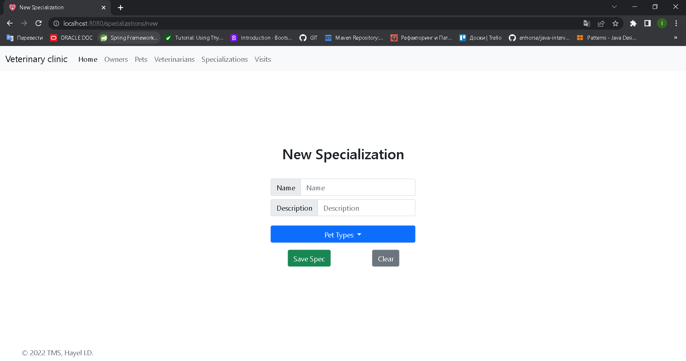

# Spring Veterinary Clinic

## Veterinary Clinic `SOLUTION IN PROGRESS`

--- 

## Table of contents

### 1. [Task](#task)

### 2. [Entity diagram](#entity-diagram)

### 3. [Current view](#current-view)

--- 

### Task

> `Veterinary clinic` simulation.

---

### Entity diagram

---

### Current view

#### Home

#### Owners

#### New owner

#### Email validation

#### Edit owner

#### Owner add pet

#### Pets

#### Edit pet

#### Veterinarians

#### New veterinarian

#### Edit veterinarian

#### Specializations

#### New specialization

#### Visits

#### New visit

#### Date and time picker

#### Edit visit

